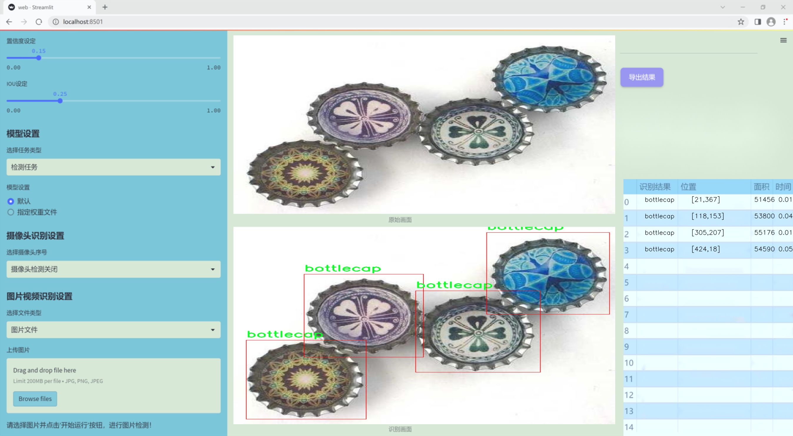
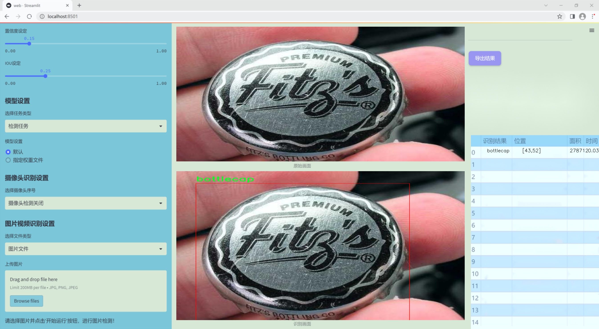
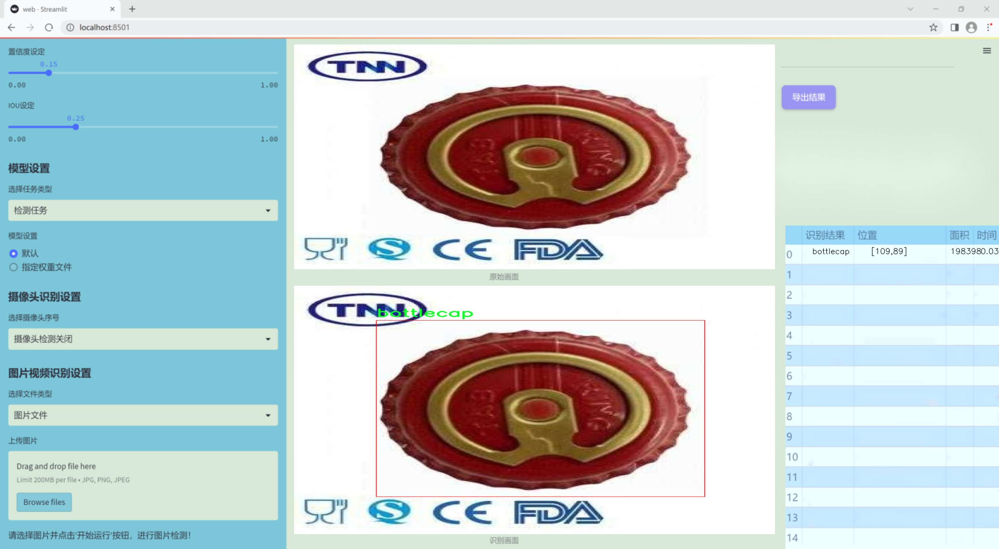
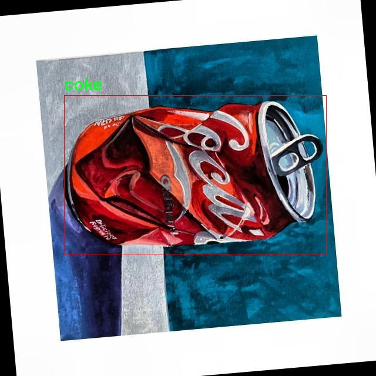
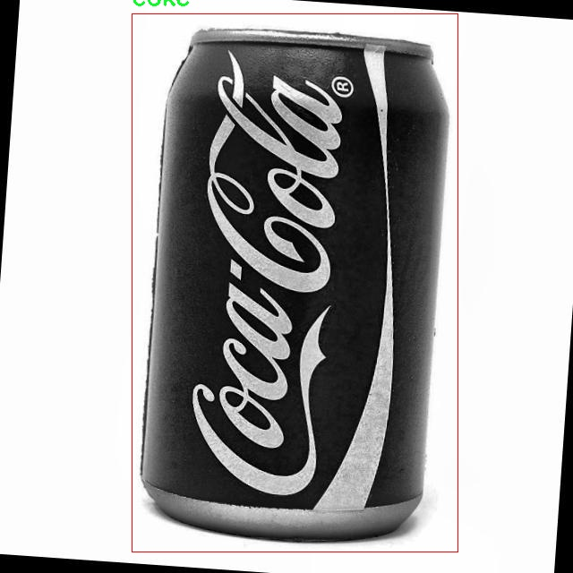

### 1.背景意义

研究背景与意义

随着全球对可持续发展和资源循环利用的关注日益增强，废弃物管理与回收利用成为了现代社会面临的重要挑战之一。金属垃圾，作为一种常见的可回收物品，其有效检测与分类对于提升资源回收率、减少环境污染具有重要意义。传统的金属垃圾检测方法往往依赖人工分拣，不仅效率低下，而且容易受到人为因素的影响，导致分类不准确。因此，基于计算机视觉技术的自动化检测系统应运而生，成为提升金属垃圾回收效率的有效解决方案。

在众多计算机视觉算法中，YOLO（You Only Look Once）系列算法因其高效的实时目标检测能力而备受青睐。YOLOv11作为该系列的最新版本，进一步优化了检测精度和速度，适合于处理复杂的环境和多样化的物体。在本研究中，我们将基于改进的YOLOv11算法，构建一个专门针对可回收金属垃圾的检测系统。该系统旨在通过深度学习技术，实现对四类金属垃圾（瓶盖、硬币、可乐罐和回形针）的高效识别与分类。

为支持这一目标，我们使用了一个包含2217张图像的数据集，涵盖了上述四类物品。数据集经过精心标注，并进行了多种预处理和增强，以提高模型的泛化能力和鲁棒性。通过对这些数据的深入分析与训练，我们期望不仅能够提升金属垃圾的检测精度，还能为后续的智能垃圾分类系统提供坚实的基础。

综上所述，基于改进YOLOv11的可回收金属垃圾检测系统的研究，不仅有助于推动智能垃圾分类技术的发展，还将为实现资源的高效回收和环境保护贡献一份力量。这一研究的成功实施，将为可持续发展目标的实现提供重要的技术支持和实践经验。

### 2.视频效果

[2.1 视频效果](https://www.bilibili.com/video/BV1d5U6YvEGe/)

### 3.图片效果







##### [项目涉及的源码数据来源链接](https://kdocs.cn/l/cszuIiCKVNis)**

注意：本项目提供训练的数据集和训练教程,由于版本持续更新,暂不提供权重文件（best.pt）,请按照6.训练教程进行训练后实现上图演示的效果。

### 4.数据集信息

##### 4.1 本项目数据集类别数＆类别名

nc: 4
names: ['bottlecap', 'coin', 'coke', 'paperclips']


该项目为【目标检测】数据集，请在【训练教程和Web端加载模型教程（第三步）】这一步的时候按照【目标检测】部分的教程来训练

##### 4.2 本项目数据集信息介绍

本项目数据集信息介绍

本项目旨在开发一个改进版的YOLOv11模型，以实现高效的可回收金属垃圾检测系统。为此，我们构建了一个专门的数据集，专注于物体检测领域，涵盖了四种主要类别的可回收物品。这些类别包括瓶盖（bottlecap）、硬币（coin）、可乐罐（coke）和回形针（paperclips）。每个类别在数据集中都经过精心标注，以确保模型能够准确识别和分类这些物品。

数据集的构建过程涉及多种数据采集方法，包括实地拍摄和合成图像生成。我们从不同的环境和光照条件下收集了大量样本，以增强模型的鲁棒性和适应性。每个类别的样本数量均衡，确保模型在训练过程中不会偏向某一特定类别，从而提高整体检测性能。数据集中包含的图像经过预处理，确保了其质量和清晰度，以便于模型的学习和训练。

在数据标注方面，我们采用了高精度的标注工具，确保每个物体的边界框准确无误。这对于YOLOv11模型的训练至关重要，因为准确的标注能够直接影响模型的检测精度和召回率。此外，数据集还包括多种场景下的图像，以模拟实际应用中的复杂情况，例如不同的背景、物体的遮挡以及各种拍摄角度。

通过这一数据集的构建，我们希望为可回收金属垃圾的自动检测提供一个坚实的基础，从而推动环境保护和资源回收的相关研究。我们相信，改进后的YOLOv11模型将能够在实际应用中展现出卓越的性能，为可持续发展贡献一份力量。








### 5.全套项目环境部署视频教程（零基础手把手教学）

[5.1 所需软件PyCharm和Anaconda安装教程（第一步）](https://www.bilibili.com/video/BV1BoC1YCEKi/?spm_id_from=333.999.0.0&vd_source=bc9aec86d164b67a7004b996143742dc)


[5.2 安装Python虚拟环境创建和依赖库安装视频教程（第二步）](https://www.bilibili.com/video/BV1ZoC1YCEBw?spm_id_from=333.788.videopod.sections&vd_source=bc9aec86d164b67a7004b996143742dc)

### 6.改进YOLOv11训练教程和Web_UI前端加载模型教程（零基础手把手教学）

[6.1 改进YOLOv11训练教程和Web_UI前端加载模型教程（第三步）](https://www.bilibili.com/video/BV1BoC1YCEhR?spm_id_from=333.788.videopod.sections&vd_source=bc9aec86d164b67a7004b996143742dc)


按照上面的训练视频教程链接加载项目提供的数据集，运行train.py即可开始训练



     Epoch   gpu_mem       box       obj       cls    labels  img_size
     1/200     20.8G   0.01576   0.01955  0.007536        22      1280: 100%|██████████| 849/849 [14:42<00:00,  1.04s/it]
               Class     Images     Labels          P          R     mAP@.5 mAP@.5:.95: 100%|██████████| 213/213 [01:14<00:00,  2.87it/s]
                 all       3395      17314      0.994      0.957      0.0957      0.0843

     Epoch   gpu_mem       box       obj       cls    labels  img_size
     2/200     20.8G   0.01578   0.01923  0.007006        22      1280: 100%|██████████| 849/849 [14:44<00:00,  1.04s/it]
               Class     Images     Labels          P          R     mAP@.5 mAP@.5:.95: 100%|██████████| 213/213 [01:12<00:00,  2.95it/s]
                 all       3395      17314      0.996      0.956      0.0957      0.0845

     Epoch   gpu_mem       box       obj       cls    labels  img_size
     3/200     20.8G   0.01561    0.0191  0.006895        27      1280: 100%|██████████| 849/849 [10:56<00:00,  1.29it/s]
               Class     Images     Labels          P          R     mAP@.5 mAP@.5:.95: 100%|███████   | 187/213 [00:52<00:00,  4.04it/s]
                 all       3395      17314      0.996      0.957      0.0957      0.0845


###### [项目数据集下载链接](https://kdocs.cn/l/cszuIiCKVNis)

### 7.原始YOLOv11算法讲解

##### YOLO11简介

> YOLO11源码地址：https://github.com/ultralytics/ultralytics

Ultralytics
YOLO11是一款尖端的、最先进的模型，它在之前YOLO版本成功的基础上进行了构建，并引入了新功能和改进，以进一步提升性能和灵活性。YOLO11设计快速、准确且易于使用，使其成为各种物体检测和跟踪、实例分割、图像分类以及姿态估计任务的绝佳选择。  


**YOLO11创新点如下:**

YOLO 11主要改进包括：  
`增强的特征提取`：YOLO 11采用了改进的骨干和颈部架构，增强了特征提取功能，以实现更精确的目标检测。  
`优化的效率和速度`：优化的架构设计和优化的训练管道提供更快的处理速度，同时保持准确性和性能之间的平衡。  
`更高的精度，更少的参数`：YOLO11m在COCO数据集上实现了更高的平均精度（mAP），参数比YOLOv8m少22%，使其在不影响精度的情况下提高了计算效率。  
`跨环境的适应性`：YOLO 11可以部署在各种环境中，包括边缘设备、云平台和支持NVIDIA GPU的系统。  
`广泛的支持任务`：YOLO 11支持各种计算机视觉任务，如对象检测、实例分割、图像分类、姿态估计和面向对象检测（OBB）。

**YOLO11不同模型尺寸信息：**

YOLO11 提供5种不同的型号规模模型，以满足不同的应用需求：

Model| size (pixels)| mAPval 50-95| Speed CPU ONNX (ms)| Speed T4 TensorRT10
(ms)| params (M)| FLOPs (B)  
---|---|---|---|---|---|---  
YOLO11n| 640| 39.5| 56.1 ± 0.8| 1.5 ± 0.0| 2.6| 6.5  
YOLO11s| 640| 47.0| 90.0 ± 1.2| 2.5 ± 0.0| 9.4| 21.5  
YOLO11m| 640| 51.5| 183.2 ± 2.0| 4.7 ± 0.1| 20.1| 68.0  
YOLO11l| 640| 53.4| 238.6 ± 1.4| 6.2 ± 0.1| 25.3| 86.9  
YOLO11x| 640| 54.7| 462.8 ± 6.7| 11.3 ± 0.2| 56.9| 194.9  
  
**模型常用训练超参数参数说明：**  
`YOLOv11
模型的训练设置包括训练过程中使用的各种超参数和配置`。这些设置会影响模型的性能、速度和准确性。关键的训练设置包括批量大小、学习率、动量和权重衰减。此外，优化器、损失函数和训练数据集组成的选择也会影响训练过程。对这些设置进行仔细的调整和实验对于优化性能至关重要。  
**以下是一些常用的模型训练参数和说明：**

参数名| 默认值| 说明  
---|---|---  
`model`| `None`| 指定用于训练的模型文件。接受指向 `.pt` 预训练模型或 `.yaml`
配置文件。对于定义模型结构或初始化权重至关重要。  
`data`| `None`| 数据集配置文件的路径（例如
`coco8.yaml`).该文件包含特定于数据集的参数，包括训练数据和验证数据的路径、类名和类数。  
`epochs`| `100`| 训练总轮数。每个epoch代表对整个数据集进行一次完整的训练。调整该值会影响训练时间和模型性能。  
`patience`| `100`| 在验证指标没有改善的情况下，提前停止训练所需的epoch数。当性能趋于平稳时停止训练，有助于防止过度拟合。  
`batch`| `16`| 批量大小，有三种模式:设置为整数(例如，’ Batch =16 ‘)， 60% GPU内存利用率的自动模式(’ Batch
=-1 ‘)，或指定利用率分数的自动模式(’ Batch =0.70 ')。  
`imgsz`| `640`| 用于训练的目标图像尺寸。所有图像在输入模型前都会被调整到这一尺寸。影响模型精度和计算复杂度。  
`device`| `None`| 指定用于训练的计算设备：单个 GPU (`device=0`）、多个 GPU (`device=0,1`)、CPU
(`device=cpu`)，或苹果芯片的 MPS (`device=mps`).  
`workers`| `8`| 加载数据的工作线程数（每 `RANK` 多 GPU 训练）。影响数据预处理和输入模型的速度，尤其适用于多 GPU 设置。  
`name`| `None`| 训练运行的名称。用于在项目文件夹内创建一个子目录，用于存储训练日志和输出结果。  
`pretrained`| `True`| 决定是否从预处理模型开始训练。可以是布尔值，也可以是加载权重的特定模型的字符串路径。提高训练效率和模型性能。  
`optimizer`| `'auto'`| 为训练模型选择优化器。选项包括 `SGD`, `Adam`, `AdamW`, `NAdam`,
`RAdam`, `RMSProp` 等，或 `auto` 用于根据模型配置进行自动选择。影响收敛速度和稳定性  
`lr0`| `0.01`| 初始学习率（即 `SGD=1E-2`, `Adam=1E-3`) .调整这个值对优化过程至关重要，会影响模型权重的更新速度。  
`lrf`| `0.01`| 最终学习率占初始学习率的百分比 = (`lr0 * lrf`)，与调度程序结合使用，随着时间的推移调整学习率。  


**各损失函数作用说明：**  
`定位损失box_loss`：预测框与标定框之间的误差（GIoU），越小定位得越准；  
`分类损失cls_loss`：计算锚框与对应的标定分类是否正确，越小分类得越准；  
`动态特征损失（dfl_loss）`：DFLLoss是一种用于回归预测框与目标框之间距离的损失函数。在计算损失时，目标框需要缩放到特征图尺度，即除以相应的stride，并与预测的边界框计算Ciou
Loss，同时与预测的anchors中心点到各边的距离计算回归DFLLoss。  


### 8.200+种全套改进YOLOV11创新点原理讲解

#### 8.1 200+种全套改进YOLOV11创新点原理讲解大全

由于篇幅限制，每个创新点的具体原理讲解就不全部展开，具体见下列网址中的改进模块对应项目的技术原理博客网址【Blog】（创新点均为模块化搭建，原理适配YOLOv5~YOLOv11等各种版本）

[改进模块技术原理博客【Blog】网址链接](https://gitee.com/qunmasj/good)


#### 8.2 精选部分改进YOLOV11创新点原理讲解

###### 这里节选部分改进创新点展开原理讲解(完整的改进原理见上图和[改进模块技术原理博客链接](https://gitee.com/qunmasj/good)【如果此小节的图加载失败可以通过CSDN或者Github搜索该博客的标题访问原始博客，原始博客图片显示正常】
### 全维动态卷积ODConv
鉴于上述讨论，我们的ODConv引入了一种多维注意机制，该机制具有并行策略，用于学习卷积核在核空间的所有四个维度上的不同注意。图提供了CondConv、DyConv和ODConv的示意性比较。

ODConv的公式：根据等式1中的符号，ODConv可定义为


 将注意力标量分配给整个卷积核。图2示出了将这四种类型的关注乘以n个卷积核的过程。原则上，这四种类型的关注是相互补充的，并且以位置、信道、滤波器和核的顺序将它们逐步乘以卷积核 
 ，使得卷积运算不同w.r.t.所有空间位置、所有输入信道、所有滤波器和输入x的所有核，提供捕获丰富上下文线索的性能保证。因此，ODConv可以显著增强CNN基本卷积运算的特征提取能力。此外，具有单个卷积核的ODConv可以与标准CondConv和DyConv竞争或优于它们，为最终模型引入的额外参数大大减少。提供了大量实验来验证这些优点。通过比较等式1和等式2，我们可以清楚地看到，ODConv是一种更广义的动态卷积。此外，当设置n=1且 所有分量均为1时，只关注滤波器方向 的ODConv将减少为：将基于输入特征的SE变量应用于卷积滤波器，然后进行卷积运算（注意原始SE（Hu等人，2018b）基于输出特征，并且用于重新校准输出特征本身）。这种SE变体是ODConv的特例。


图：将ODConv中的四种注意类型逐步乘以卷积核的示例。（a） 沿空间维度的逐位置乘法运算，（b）沿输入信道维度的逐信道乘法运算、（c）沿输出信道维度的按滤波器乘法运算，以及（d）沿卷积核空间的核维度的按核乘法运算。方法部分对符号进行了说明
实现：对于ODConv，一个关键问题是如何计算卷积核的四种关注度 。继CondConv和DyConv之后，我们还使用SE型注意力模块（Hu等人，2018b），但将多个头部作为来计算它们，其结构如图所示。具体而言，首先通过逐通道全局平均池（GAP）运算将输入压缩到具有长度的特征向量中。随后，存在完全连接（FC）层和四个头部分支。ReLU（Krizhevsky等人，2012）位于FC层之后。FC层将压缩特征向量映射到具有缩减比的低维空间（根据消融实验，我们在所有主要实验中设置 ，避免了高模型复杂度）。对于四个头部分支，每个分支都有一个输出大小如图。

### 引入ODConv的改进YOLO
参考这篇博客涵盖了引入ODConv的改进YOLOv11系统的内容，ODConv采用多维注意机制，在卷积核空间的四个维度上学习不同的注意。结合了CondConv和DyConv的优势，ODConv通过图示的四种注意类型逐步与卷积核相乘，以捕获丰富的上下文线索，提升特征提取能力。

#### ODConv结构与方法
ODConv的公式和图示展示了其关注力分配给卷积核的方式，其中四种类型的关注以位置、信道、滤波器和核的顺序逐步与卷积核相乘。这种结构保证了卷积运算不同于标准的Conv操作，能够捕获更多上下文信息，从而增强了CNN的特征提取能力。另外，单个卷积核的ODConv在性能上能够与CondConv和DyConv相竞争，并且引入的额外参数大幅减少。

ODConv的特殊之处在于其广义的动态卷积性质，同时在特定条件下（n=1且所有分量为1），它可以退化为一种特例，即只关注滤波器方向，这类似于基于输入特征的SE变体，但不同于原始SE，它基于输出特征。

#### ODConv的实现
关键问题在于如何计算卷积核的四种关注度。ODConv采用了SE型注意力模块，结合了多个头部来计算这些关注度。具体实现上，通过逐通道全局平均池运算和完全连接层，将输入压缩为特征向量，随后使用四个头部分支来计算四种不同类型的关注。这样的结构能在保持模型复杂度可控的情况下，提升了特征的表征能力。

ODConv的引入为YOLOv11带来了显著的性能提升，并且通过大量实验证明了其在特征提取方面的优越性。其结合了多维注意机制和卷积操作，为目标检测和分拣系统的提升带来了新的思路和性能突破。


### 9.系统功能展示

图9.1.系统支持检测结果表格显示

  图9.2.系统支持置信度和IOU阈值手动调节

  图9.3.系统支持自定义加载权重文件best.pt(需要你通过步骤5中训练获得)

  图9.4.系统支持摄像头实时识别

  图9.5.系统支持图片识别

  图9.6.系统支持视频识别

  图9.7.系统支持识别结果文件自动保存

  图9.8.系统支持Excel导出检测结果数据


### 10. YOLOv11核心改进源码讲解

#### 10.1 val.py

以下是对给定代码的核心部分进行分析和详细注释的结果：

```python
import os
import torch
from ultralytics.data import build_dataloader, build_yolo_dataset, converter
from ultralytics.engine.validator import BaseValidator
from ultralytics.utils import LOGGER, ops
from ultralytics.utils.metrics import ConfusionMatrix, DetMetrics, box_iou

class DetectionValidator(BaseValidator):
    """
    该类扩展了BaseValidator类，用于基于检测模型的验证。
    """

    def __init__(self, dataloader=None, save_dir=None, pbar=None, args=None, _callbacks=None):
        """初始化检测模型所需的变量和设置。"""
        super().__init__(dataloader, save_dir, pbar, args, _callbacks)
        self.metrics = DetMetrics(save_dir=self.save_dir, on_plot=self.on_plot)  # 初始化检测指标
        self.iouv = torch.linspace(0.5, 0.95, 10)  # 定义mAP@0.5:0.95的IOU向量
        self.niou = self.iouv.numel()  # IOU的数量

    def preprocess(self, batch):
        """对YOLO训练的图像批次进行预处理。"""
        batch["img"] = batch["img"].to(self.device, non_blocking=True)  # 将图像移动到设备上
        batch["img"] = (batch["img"].half() if self.args.half else batch["img"].float()) / 255  # 归一化图像
        for k in ["batch_idx", "cls", "bboxes"]:
            batch[k] = batch[k].to(self.device)  # 将其他数据移动到设备上
        return batch

    def init_metrics(self, model):
        """初始化YOLO的评估指标。"""
        self.names = model.names  # 获取模型的类别名称
        self.nc = len(model.names)  # 类别数量
        self.metrics.names = self.names  # 设置指标的类别名称
        self.confusion_matrix = ConfusionMatrix(nc=self.nc)  # 初始化混淆矩阵

    def postprocess(self, preds):
        """对预测输出应用非极大值抑制。"""
        return ops.non_max_suppression(
            preds,
            self.args.conf,
            self.args.iou,
            multi_label=True,
            agnostic=self.args.single_cls,
            max_det=self.args.max_det,
        )

    def update_metrics(self, preds, batch):
        """更新指标。"""
        for si, pred in enumerate(preds):
            npr = len(pred)  # 当前预测的数量
            pbatch = self._prepare_batch(si, batch)  # 准备当前批次的数据
            cls, bbox = pbatch.pop("cls"), pbatch.pop("bbox")  # 获取真实标签
            if npr == 0:
                continue  # 如果没有预测，跳过
            predn = self._prepare_pred(pred, pbatch)  # 准备预测数据
            # 计算TP（真正例）
            stat["tp"] = self._process_batch(predn, bbox, cls)  
            # 更新混淆矩阵
            self.confusion_matrix.process_batch(predn, bbox, cls)

    def finalize_metrics(self, *args, **kwargs):
        """设置指标速度和混淆矩阵的最终值。"""
        self.metrics.speed = self.speed
        self.metrics.confusion_matrix = self.confusion_matrix

    def get_stats(self):
        """返回指标统计和结果字典。"""
        stats = {k: torch.cat(v, 0).cpu().numpy() for k, v in self.stats.items()}  # 转换为numpy
        if len(stats) and stats["tp"].any():
            self.metrics.process(**stats)  # 处理指标
        return self.metrics.results_dict  # 返回结果字典

    def print_results(self):
        """打印每个类别的训练/验证集指标。"""
        pf = "%22s" + "%11i" * 2 + "%11.3g" * len(self.metrics.keys)  # 打印格式
        LOGGER.info(pf % ("all", self.seen, self.nt_per_class.sum(), *self.metrics.mean_results()))

    def _process_batch(self, detections, gt_bboxes, gt_cls):
        """
        返回正确的预测矩阵。
        """
        iou = box_iou(gt_bboxes, detections[:, :4])  # 计算IOU
        return self.match_predictions(detections[:, 5], gt_cls, iou)  # 匹配预测与真实标签

    def build_dataset(self, img_path, mode="val", batch=None):
        """
        构建YOLO数据集。
        """
        return build_yolo_dataset(self.args, img_path, batch, self.data, mode=mode)

    def get_dataloader(self, dataset_path, batch_size):
        """构造并返回数据加载器。"""
        dataset = self.build_dataset(dataset_path, batch=batch_size, mode="val")
        return build_dataloader(dataset, batch_size, self.args.workers, shuffle=False)  # 返回数据加载器
```

### 核心部分分析
1. **类定义**：`DetectionValidator`类继承自`BaseValidator`，用于YOLO模型的验证。
2. **初始化方法**：`__init__`方法中初始化了一些必要的变量和设置，包括指标、IOU向量等。
3. **预处理**：`preprocess`方法对输入的图像批次进行归一化和设备转移。
4. **指标初始化**：`init_metrics`方法初始化评估指标和混淆矩阵。
5. **后处理**：`postprocess`方法应用非极大值抑制来过滤预测结果。
6. **更新指标**：`update_metrics`方法更新当前批次的指标，包括计算TP和更新混淆矩阵。
7. **最终指标**：`finalize_metrics`方法设置最终的指标速度和混淆矩阵。
8. **获取统计信息**：`get_stats`方法返回指标统计信息。
9. **打印结果**：`print_results`方法打印每个类别的验证结果。
10. **数据集构建**：`build_dataset`和`get_dataloader`方法用于构建YOLO数据集和数据加载器。

这些核心部分是YOLO模型验证的基础，涵盖了从数据预处理到指标计算和结果输出的整个流程。

这个程序文件 `val.py` 是一个用于验证目标检测模型（如 YOLO）的类和函数的实现，主要是为了评估模型在验证集上的性能。文件中包含了许多与数据处理、模型评估和结果可视化相关的功能。

首先，文件导入了一些必要的库和模块，包括 `os`、`numpy` 和 `torch`，以及一些来自 `ultralytics` 库的工具和类，这些工具和类用于构建数据加载器、处理数据集、计算指标等。

`DetectionValidator` 类继承自 `BaseValidator`，它的主要职责是进行目标检测模型的验证。构造函数中初始化了一些必要的变量和设置，包括处理设备、任务类型、评估指标等。特别地，它定义了一个 `iouv` 向量，用于计算不同 IoU（Intersection over Union）阈值下的 mAP（mean Average Precision）。

在 `preprocess` 方法中，输入的图像批次会被处理，包括将图像转换为合适的格式和范围（如归一化），并将目标框（bounding boxes）进行缩放，以适应当前图像的尺寸。

`init_metrics` 方法用于初始化评估指标，包括判断数据集是否为 COCO 格式，并设置相应的类别映射和指标对象。`get_desc` 方法返回一个格式化的字符串，用于描述每个类别的评估指标。

`postprocess` 方法应用非极大值抑制（NMS）来处理模型的预测输出，以减少冗余的检测框。`_prepare_batch` 和 `_prepare_pred` 方法则用于准备验证过程中所需的批次数据和预测数据。

在 `update_metrics` 方法中，模型的预测结果与真实标签进行比较，更新各种统计信息，包括正确预测的数量、置信度等。此方法还负责保存预测结果到 JSON 或 TXT 文件中。

`finalize_metrics` 方法用于设置最终的指标值，而 `get_stats` 方法则返回统计信息和结果字典。`print_results` 方法打印出每个类别的训练或验证集指标，并在需要时绘制混淆矩阵。

此外，文件中还包含了一些用于构建数据集和数据加载器的方法，如 `build_dataset` 和 `get_dataloader`，这些方法帮助加载验证集的图像和标签。

最后，文件提供了一些可视化功能，如 `plot_val_samples` 和 `plot_predictions`，用于绘制验证图像和模型的预测结果。`save_one_txt` 和 `pred_to_json` 方法则负责将预测结果保存为特定格式的文件，以便后续分析和评估。

整体来看，这个文件是一个完整的目标检测模型验证框架，涵盖了从数据预处理到结果评估和可视化的各个方面。

#### 10.2 SwinTransformer.py

以下是经过简化并添加详细中文注释的核心代码部分：

```python
import torch
import torch.nn as nn
import torch.nn.functional as F
import numpy as np

class Mlp(nn.Module):
    """ 多层感知机（MLP）模块 """

    def __init__(self, in_features, hidden_features=None, out_features=None, act_layer=nn.GELU, drop=0.):
        super().__init__()
        out_features = out_features or in_features  # 输出特征数
        hidden_features = hidden_features or in_features  # 隐藏层特征数
        self.fc1 = nn.Linear(in_features, hidden_features)  # 第一层线性变换
        self.act = act_layer()  # 激活函数
        self.fc2 = nn.Linear(hidden_features, out_features)  # 第二层线性变换
        self.drop = nn.Dropout(drop)  # Dropout层

    def forward(self, x):
        """ 前向传播 """
        x = self.fc1(x)  # 线性变换
        x = self.act(x)  # 激活
        x = self.drop(x)  # Dropout
        x = self.fc2(x)  # 线性变换
        x = self.drop(x)  # Dropout
        return x


class WindowAttention(nn.Module):
    """ 窗口注意力机制模块 """

    def __init__(self, dim, window_size, num_heads, qkv_bias=True, attn_drop=0., proj_drop=0.):
        super().__init__()
        self.dim = dim  # 输入通道数
        self.window_size = window_size  # 窗口大小
        self.num_heads = num_heads  # 注意力头数
        head_dim = dim // num_heads  # 每个头的维度
        self.scale = head_dim ** -0.5  # 缩放因子

        # 定义相对位置偏置参数
        self.relative_position_bias_table = nn.Parameter(
            torch.zeros((2 * window_size[0] - 1) * (2 * window_size[1] - 1), num_heads))

        # 计算相对位置索引
        coords_h = torch.arange(self.window_size[0])
        coords_w = torch.arange(self.window_size[1])
        coords = torch.stack(torch.meshgrid([coords_h, coords_w]))  # 生成坐标网格
        coords_flatten = torch.flatten(coords, 1)  # 展平坐标
        relative_coords = coords_flatten[:, :, None] - coords_flatten[:, None, :]  # 计算相对坐标
        relative_coords = relative_coords.permute(1, 2, 0).contiguous()  # 调整维度
        relative_coords[:, :, 0] += self.window_size[0] - 1  # 调整坐标范围
        relative_coords[:, :, 1] += self.window_size[1] - 1
        relative_coords[:, :, 0] *= 2 * self.window_size[1] - 1
        relative_position_index = relative_coords.sum(-1)  # 计算相对位置索引
        self.register_buffer("relative_position_index", relative_position_index)  # 注册为缓冲区

        self.qkv = nn.Linear(dim, dim * 3, bias=qkv_bias)  # 线性变换用于生成Q、K、V
        self.attn_drop = nn.Dropout(attn_drop)  # 注意力的Dropout
        self.proj = nn.Linear(dim, dim)  # 输出线性变换
        self.proj_drop = nn.Dropout(proj_drop)  # 输出的Dropout
        self.softmax = nn.Softmax(dim=-1)  # Softmax层

    def forward(self, x, mask=None):
        """ 前向传播 """
        B_, N, C = x.shape  # 获取输入的形状
        qkv = self.qkv(x).reshape(B_, N, 3, self.num_heads, C // self.num_heads).permute(2, 0, 3, 1, 4)  # 计算Q、K、V
        q, k, v = qkv[0], qkv[1], qkv[2]  # 分离Q、K、V

        q = q * self.scale  # 缩放Q
        attn = (q @ k.transpose(-2, -1))  # 计算注意力得分

        # 添加相对位置偏置
        relative_position_bias = self.relative_position_bias_table[self.relative_position_index.view(-1)].view(
            self.window_size[0] * self.window_size[1], self.window_size[0] * self.window_size[1], -1)
        relative_position_bias = relative_position_bias.permute(2, 0, 1).contiguous()  # 调整维度
        attn = attn + relative_position_bias.unsqueeze(0)  # 加入相对位置偏置

        if mask is not None:
            attn = attn + mask.unsqueeze(1).unsqueeze(0)  # 加入mask
        attn = self.softmax(attn)  # Softmax归一化
        attn = self.attn_drop(attn)  # Dropout

        x = (attn @ v).transpose(1, 2).reshape(B_, N, C)  # 计算输出
        x = self.proj(x)  # 输出线性变换
        x = self.proj_drop(x)  # Dropout
        return x


class SwinTransformer(nn.Module):
    """ Swin Transformer 主体 """

    def __init__(self, embed_dim=96, depths=[2, 2, 6, 2], num_heads=[3, 6, 12, 24], window_size=7):
        super().__init__()
        self.embed_dim = embed_dim  # 嵌入维度
        self.layers = nn.ModuleList()  # 存储各层

        # 构建每一层
        for i_layer in range(len(depths)):
            layer = BasicLayer(
                dim=int(embed_dim * 2 ** i_layer),
                depth=depths[i_layer],
                num_heads=num_heads[i_layer],
                window_size=window_size)
            self.layers.append(layer)

    def forward(self, x):
        """ 前向传播 """
        for layer in self.layers:
            x = layer(x)  # 逐层传递
        return x  # 返回最终输出
```

### 代码说明：
1. **Mlp类**：实现了一个多层感知机，包含两层线性变换和激活函数。
2. **WindowAttention类**：实现了窗口注意力机制，支持相对位置偏置。
3. **SwinTransformer类**：实现了Swin Transformer的主体结构，包含多个基本层（BasicLayer），每层使用窗口注意力机制进行特征提取。

该代码片段是Swin Transformer模型的核心部分，负责实现特征提取和注意力机制。

这个程序文件实现了Swin Transformer模型的结构，Swin Transformer是一种基于视觉的Transformer架构，具有分层和移动窗口的特性。代码中定义了多个类和函数，以实现模型的各个组成部分。

首先，程序导入了必要的库，包括PyTorch的核心模块和一些用于构建模型的辅助函数。接着，定义了一个名为`Mlp`的类，这是一个多层感知机（MLP），用于在Transformer的每个块中进行前馈神经网络的计算。`Mlp`类的构造函数接受输入特征、隐藏特征和输出特征的维度，以及激活函数和丢弃率。其`forward`方法实现了前向传播。

接下来，定义了`window_partition`和`window_reverse`函数，这两个函数用于将输入特征分割成窗口以及将窗口合并回原始特征。窗口的概念是Swin Transformer的核心之一，它允许模型在局部区域内进行自注意力计算。

`WindowAttention`类实现了基于窗口的多头自注意力机制，支持相对位置偏置。它的构造函数定义了输入通道数、窗口大小、注意力头数等参数，并初始化了一些必要的权重。`forward`方法实现了自注意力的计算过程，包括查询、键、值的计算，以及相对位置偏置的应用。

`SwinTransformerBlock`类则是Swin Transformer的基本构建块，包含了归一化层、窗口注意力层和前馈网络。它的`forward`方法实现了输入特征的处理，包括规范化、窗口划分、注意力计算和前馈网络的应用。

`PatchMerging`类用于将特征图的补丁合并，以减少特征图的分辨率。它的`forward`方法实现了特征的重组和归一化。

`BasicLayer`类表示Swin Transformer中的一个基本层，包含多个`SwinTransformerBlock`。它的构造函数接受层的深度、头数、窗口大小等参数，并构建出多个块。`forward`方法计算输入特征的处理，并在必要时进行下采样。

`PatchEmbed`类用于将输入图像分割成补丁并进行嵌入。它的`forward`方法实现了图像的填充、卷积操作和归一化。

`SwinTransformer`类是整个模型的主类，负责将所有的组件组合在一起。它的构造函数定义了输入图像的大小、补丁大小、嵌入维度、每个阶段的深度和头数等参数，并构建出各个层。`forward`方法实现了模型的前向传播过程，包括补丁嵌入、位置编码的添加、各层的处理以及输出的归一化。

最后，`update_weight`函数用于更新模型的权重，确保加载的权重与模型的结构匹配。`SwinTransformer_Tiny`函数则是一个工厂函数，用于创建一个小型的Swin Transformer模型，并在提供权重文件时加载相应的权重。

总体而言，这个程序文件实现了Swin Transformer的完整结构，涵盖了模型的各个部分，包括嵌入、注意力机制、前馈网络和层的组合，适用于图像处理任务。

#### 10.3 RFAConv.py

以下是代码中最核心的部分，并附上详细的中文注释：

```python
import torch
import torch.nn as nn
from einops import rearrange

class RFAConv(nn.Module):
    def __init__(self, in_channel, out_channel, kernel_size, stride=1):
        super().__init__()
        self.kernel_size = kernel_size

        # 用于获取权重的卷积模块
        self.get_weight = nn.Sequential(
            nn.AvgPool2d(kernel_size=kernel_size, padding=kernel_size // 2, stride=stride),
            nn.Conv2d(in_channel, in_channel * (kernel_size ** 2), kernel_size=1, groups=in_channel, bias=False)
        )
        
        # 用于生成特征的卷积模块
        self.generate_feature = nn.Sequential(
            nn.Conv2d(in_channel, in_channel * (kernel_size ** 2), kernel_size=kernel_size, padding=kernel_size // 2, stride=stride, groups=in_channel, bias=False),
            nn.BatchNorm2d(in_channel * (kernel_size ** 2)),
            nn.ReLU()
        )
        
        # 最终的卷积层
        self.conv = nn.Conv2d(in_channel, out_channel, kernel_size=kernel_size, stride=kernel_size)

    def forward(self, x):
        b, c = x.shape[0:2]  # 获取输入的批量大小和通道数
        weight = self.get_weight(x)  # 获取权重
        h, w = weight.shape[2:]  # 获取特征图的高和宽
        
        # 对权重进行softmax归一化
        weighted = weight.view(b, c, self.kernel_size ** 2, h, w).softmax(2)  # b c*kernel**2, h, w
        
        # 生成特征并调整形状
        feature = self.generate_feature(x).view(b, c, self.kernel_size ** 2, h, w)  # b c*kernel**2, h, w
        
        # 加权特征
        weighted_data = feature * weighted
        
        # 调整形状以进行卷积
        conv_data = rearrange(weighted_data, 'b c (n1 n2) h w -> b c (h n1) (w n2)', n1=self.kernel_size, n2=self.kernel_size)
        
        return self.conv(conv_data)  # 返回卷积结果


class SE(nn.Module):
    def __init__(self, in_channel, ratio=16):
        super(SE, self).__init__()
        self.gap = nn.AdaptiveAvgPool2d((1, 1))  # 全局平均池化
        self.fc = nn.Sequential(
            nn.Linear(in_channel, ratio, bias=False),  # 从 c -> c/r
            nn.ReLU(),
            nn.Linear(ratio, in_channel, bias=False),  # 从 c/r -> c
            nn.Sigmoid()
        )

    def forward(self, x):
        b, c = x.shape[0:2]  # 获取输入的批量大小和通道数
        y = self.gap(x).view(b, c)  # 进行全局平均池化并调整形状
        y = self.fc(y).view(b, c, 1, 1)  # 通过全连接层并调整形状
        return y  # 返回通道注意力权重


class RFCBAMConv(nn.Module):
    def __init__(self, in_channel, out_channel, kernel_size=3, stride=1):
        super().__init__()
        self.kernel_size = kernel_size
        
        # 特征生成模块
        self.generate = nn.Sequential(
            nn.Conv2d(in_channel, in_channel * (kernel_size ** 2), kernel_size, padding=kernel_size // 2, stride=stride, groups=in_channel, bias=False),
            nn.BatchNorm2d(in_channel * (kernel_size ** 2)),
            nn.ReLU()
        )
        
        # 权重获取模块
        self.get_weight = nn.Sequential(nn.Conv2d(2, 1, kernel_size=3, padding=1, bias=False), nn.Sigmoid())
        self.se = SE(in_channel)  # 通道注意力模块

        # 最终的卷积层
        self.conv = nn.Conv2d(in_channel, out_channel, kernel_size=kernel_size, stride=kernel_size)

    def forward(self, x):
        b, c = x.shape[0:2]  # 获取输入的批量大小和通道数
        channel_attention = self.se(x)  # 获取通道注意力
        generate_feature = self.generate(x)  # 生成特征

        h, w = generate_feature.shape[2:]  # 获取特征图的高和宽
        generate_feature = generate_feature.view(b, c, self.kernel_size ** 2, h, w)  # 调整形状
        
        # 调整形状以进行卷积
        generate_feature = rearrange(generate_feature, 'b c (n1 n2) h w -> b c (h n1) (w n2)', n1=self.kernel_size, n2=self.kernel_size)
        
        # 加权特征
        unfold_feature = generate_feature * channel_attention
        
        # 计算最大值和均值特征
        max_feature, _ = torch.max(generate_feature, dim=1, keepdim=True)
        mean_feature = torch.mean(generate_feature, dim=1, keepdim=True)
        
        # 获取感受野注意力
        receptive_field_attention = self.get_weight(torch.cat((max_feature, mean_feature), dim=1))
        
        # 返回卷积结果
        conv_data = unfold_feature * receptive_field_attention
        return self.conv(conv_data)
```

### 代码说明：
1. **RFAConv**: 该类实现了一种卷积层，结合了特征生成和权重计算，通过自适应的方式来增强特征表示。
2. **SE**: 该类实现了Squeeze-and-Excitation模块，用于生成通道注意力权重，增强网络对重要特征的关注。
3. **RFCBAMConv**: 该类结合了RFAConv和SE模块，进一步增强了特征提取能力，并引入了感受野注意力机制。

这些模块可以用于构建更复杂的神经网络架构，提升图像处理任务的性能。

这个程序文件 `RFAConv.py` 定义了一些用于卷积神经网络的模块，主要包括 `RFAConv`、`RFCBAMConv` 和 `RFCAConv` 三个类，以及一些辅助的激活函数和注意力机制。下面是对代码的详细说明。

首先，文件导入了必要的库，包括 PyTorch 的核心模块和一些自定义的卷积模块。接着，定义了两个激活函数类 `h_sigmoid` 和 `h_swish`，这两个类分别实现了 h-sigmoid 和 h-swish 激活函数，通常用于提高网络的非线性表达能力。

`RFAConv` 类是一个自定义的卷积层，它通过加权的方式生成特征图。初始化时，它接受输入通道数、输出通道数、卷积核大小和步幅作为参数。该类内部定义了两个主要的子模块：`get_weight` 和 `generate_feature`。`get_weight` 通过平均池化和卷积操作生成权重，而 `generate_feature` 则通过卷积、批归一化和 ReLU 激活生成特征。前向传播中，首先计算权重，然后生成特征，接着将特征与权重相乘，最后通过重排和卷积得到输出。

`SE` 类实现了 Squeeze-and-Excitation (SE) 模块，用于增强特征的表达能力。它通过全局平均池化和全连接层来生成通道注意力权重，进而调整输入特征的通道信息。

`RFCBAMConv` 类是一个结合了通道注意力和空间注意力的卷积模块。它在初始化时定义了生成特征的卷积层、获取权重的卷积层以及 SE 模块。在前向传播中，首先计算通道注意力，然后生成特征并重排，接着计算最大值和均值特征以生成空间注意力权重，最后将特征与注意力权重相乘并通过卷积得到输出。

`RFCAConv` 类则实现了一种更复杂的卷积模块，结合了空间和通道注意力机制。它在初始化时定义了生成特征的卷积层、用于计算通道注意力的卷积层以及最终的卷积层。在前向传播中，生成特征后，通过自适应平均池化计算水平和垂直方向的特征，然后将它们拼接并通过一系列卷积和激活操作生成通道注意力，最后将特征与注意力权重相乘并通过卷积得到最终输出。

总体而言，这个文件实现了一些先进的卷积操作和注意力机制，旨在提高卷积神经网络的性能，尤其是在处理图像等高维数据时。

#### 10.4 utils.py

以下是代码中最核心的部分，并附上详细的中文注释：

```python
import torch
import torch.nn.functional as F

def multi_scale_deformable_attn_pytorch(
    value: torch.Tensor,
    value_spatial_shapes: torch.Tensor,
    sampling_locations: torch.Tensor,
    attention_weights: torch.Tensor,
) -> torch.Tensor:
    """
    多尺度可变形注意力机制。

    参数:
        value: 输入特征图，形状为 (bs, C, num_heads, embed_dims)
        value_spatial_shapes: 特征图的空间形状，形状为 (num_levels, 2)
        sampling_locations: 采样位置，形状为 (bs, num_queries, num_heads, num_levels, num_points, 2)
        attention_weights: 注意力权重，形状为 (bs, num_heads, num_queries, num_levels, num_points)

    返回:
        output: 经过多尺度可变形注意力机制处理后的输出，形状为 (bs, num_queries, num_heads * embed_dims)
    """
    bs, _, num_heads, embed_dims = value.shape  # 获取输入特征图的批次大小、通道数、头数和嵌入维度
    _, num_queries, _, num_levels, num_points, _ = sampling_locations.shape  # 获取采样位置的相关维度

    # 将输入特征图按照空间形状拆分成多个特征图
    value_list = value.split([H_ * W_ for H_, W_ in value_spatial_shapes], dim=1)
    
    # 将采样位置转换到[-1, 1]范围
    sampling_grids = 2 * sampling_locations - 1
    sampling_value_list = []  # 用于存储每个尺度的采样值

    for level, (H_, W_) in enumerate(value_spatial_shapes):
        # 对于每个尺度，调整特征图的形状以便进行采样
        value_l_ = value_list[level].flatten(2).transpose(1, 2).reshape(bs * num_heads, embed_dims, H_, W_)
        
        # 调整采样网格的形状
        sampling_grid_l_ = sampling_grids[:, :, :, level].transpose(1, 2).flatten(0, 1)
        
        # 使用grid_sample进行双线性插值采样
        sampling_value_l_ = F.grid_sample(
            value_l_, sampling_grid_l_, mode="bilinear", padding_mode="zeros", align_corners=False
        )
        sampling_value_list.append(sampling_value_l_)  # 将采样结果添加到列表中

    # 调整注意力权重的形状以便进行加权求和
    attention_weights = attention_weights.transpose(1, 2).reshape(
        bs * num_heads, 1, num_queries, num_levels * num_points
    )
    
    # 计算最终输出，进行加权求和
    output = (
        (torch.stack(sampling_value_list, dim=-2).flatten(-2) * attention_weights)
        .sum(-1)
        .view(bs, num_heads * embed_dims, num_queries)
    )
    
    return output.transpose(1, 2).contiguous()  # 返回输出，调整形状以符合预期
```

### 代码说明：
1. **函数定义**：`multi_scale_deformable_attn_pytorch`函数实现了多尺度可变形注意力机制。
2. **参数说明**：
   - `value`：输入特征图，包含多个头的特征信息。
   - `value_spatial_shapes`：特征图的空间形状，用于确定每个尺度的高和宽。
   - `sampling_locations`：指定在特征图上进行采样的位置。
   - `attention_weights`：每个查询对应的注意力权重。
3. **主要步骤**：
   - 拆分输入特征图为多个尺度。
   - 将采样位置转换到[-1, 1]范围。
   - 对每个尺度的特征图进行双线性插值采样。
   - 调整注意力权重的形状并进行加权求和，最终得到输出。

这个程序文件 `utils.py` 是一个用于实现一些常用功能的模块，主要涉及深度学习中的模型初始化和多尺度可变形注意力机制。文件中使用了 PyTorch 库，包含了一些重要的函数和工具。

首先，文件引入了必要的库，包括 `copy`、`math`、`numpy` 和 `torch` 及其子模块。接着，定义了一个 `__all__` 列表，指定了该模块公开的接口，方便其他模块导入。

文件中定义了一个 `_get_clones` 函数，该函数用于克隆给定的模块 `n` 次，并返回一个 `ModuleList`，这在构建具有多个相同层的网络时非常有用。

接下来是 `bias_init_with_prob` 函数，它根据给定的先验概率初始化卷积或全连接层的偏置值。这个函数使用了对数几率的公式，将概率转换为偏置值，以便在训练过程中更好地控制模型的输出。

`linear_init` 函数用于初始化线性模块的权重和偏置。它根据权重的形状计算一个边界值，并使用均匀分布在该范围内初始化权重和偏置。

`inverse_sigmoid` 函数计算输入张量的反 sigmoid 函数。它首先将输入限制在 [0, 1] 范围内，然后计算反 sigmoid 值。这个函数在一些模型中用于处理概率值的转换。

最后，`multi_scale_deformable_attn_pytorch` 函数实现了多尺度可变形注意力机制。该函数接收多个输入，包括值张量、空间形状、采样位置和注意力权重。函数内部首先对输入的值进行分割，然后计算采样网格，并使用 `F.grid_sample` 函数进行双线性插值，得到采样值。最后，通过加权求和的方式将采样值与注意力权重结合，输出最终的结果。

整体来看，这个模块提供了一些基础的工具函数，特别是在构建和初始化深度学习模型时非常实用，同时实现了一个复杂的多尺度注意力机制，为后续的模型训练和推理提供了支持。

### 11.完整训练+Web前端界面+200+种全套创新点源码、数据集获取


# [下载链接：https://mbd.pub/o/bread/Z5eTmJty](https://mbd.pub/o/bread/Z5eTmJty)